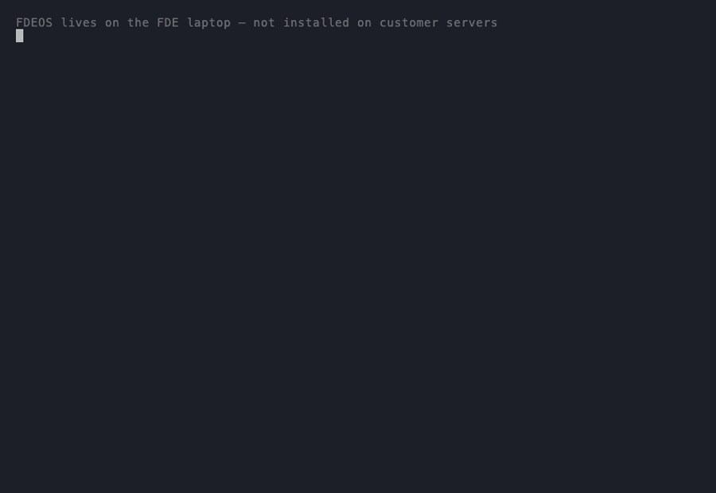

<div align="center">

# FDEOS

**The AI plugin for engineers who get embedded in client environments.**

You inherit an undocumented codebase. Stakeholders who cannot agree on what done looks like. A deadline that does not move.

FDEOS gives your AI agent the judgment to operate in that environment. How to land without breaking trust. How to find the real problem before writing code. How to ship safely in a codebase you did not build. How to leave.

[](https://github.com/suboss87/fde-os)
[](LICENSE)
[](docs/skills-reference.md)
[](https://claude.ai/code)

<br>

```
/plugin install --marketplace github:suboss87/fde-os fdeos
```

Also works with Cursor, Windsurf, Cline via `npx fdeos@latest`

<br>



<br>

*"Don't write a line of code until you know what a bad outcome looks like for the person paying."*

*"Stabilise first. Understand second. Fix third. In that order, every time."*

*"The handoff is part of the job. If the team cannot sustain it, you did not finish."*

<br>

[How it works](#how-it-works) · [Skills](#skills) · [Enterprise](#for-regulated-industries) · [Full install guide](docs/install.md)

</div>

---

## How it works

Invoke `@fde` and describe your situation in plain language. FDEOS routes silently to the right skill. You never pick a skill yourself.

Without FDEOS, your AI agent treats every engagement like a fresh coding task. With FDEOS, it knows the difference between day-one trust-building and day-thirty delivery. It reads the environment before touching code. It questions the brief. It surfaces shadow processes. It writes characterisation tests before modifying eight-year-old code. Context survives sessions. Judgment accumulates.

Everything gets written to `.fde/` in your project: trust profile, real problem, codebase map, decisions, risks, delivery record. Sessions end, context survives. Another engineer picks it up and is operational in minutes.

A typical engagement looks like this:

1. **Land.** `@fde "Starting at Acme Corp. Payments broken. First meeting in an hour."` FDEOS asks the one question that matters before you write any code.

2. **Discover.** As you learn more, `@fde` surfaces the real problem. The stated problem is rarely the real one.

3. **Plan.** `@fde-plan` breaks work into atomic tasks sequenced by risk. Adds stakeholder check-ins every few tasks so trust does not decay.

4. **Build.** `@fde-build` enforces characterisation tests before touching legacy code, blast radius analysis before every change, and a confirmed rollback path before every deploy.

5. **Review.** `@fde-review` checks two things in order: did you build what was agreed, then is it safe to ship.

6. **Ship.** `@fde-ship` runs a pre-flight checklist, deploys to canary, and verifies rollback before going to full traffic.

7. **Close.** `@fde-close` captures what was learned, extracts reusable patterns, and produces a handoff document the team can actually use.

At any point: `@fde-rescue` for production fires. `@fde-debug` for systematic debugging.

---

## Install

**Claude Code**

```
/plugin install --marketplace github:suboss87/fde-os fdeos
```

Then in your project:

```bash
echo ".fde/" >> .gitignore
```

Open Claude Code and type `@fde` to start.

For project-level FDEOS configuration (optional):

```bash
find ~/.claude/plugins/cache -path "*/fdeos*/CLAUDE.md.template" | head -1 | xargs -I{} cp {} ./CLAUDE.md
```

**Cursor, Windsurf, or any other agent**

```bash
npx fdeos@latest
```

The `.fde/` directory holds your engagement brain: trust profiles, stakeholder maps, real problem, decisions. It contains sensitive customer information and must stay local.

For detailed setup: [docs/install.md](docs/install.md).

---

## Skills

You do not pick these. `@fde` routes to the right one based on what you tell it.

**Engagement phase**

| Skill | What it does |
|-------|-------------|
| `@fde` | Entry point. Tell your story. |
| `@fde-land` | First 48 hours. Builds trust, maps stakeholders, defines success before any work starts. |
| `@fde-audit` | Taking over mid-engagement. Separates what is real from what is assumed. |
| `@fde-discover` | Finds the real problem. Maps the codebase. Surfaces shadow processes and workarounds. |
| `@fde-sketch` | Builds a throwaway to validate direction. Pitches the outcome in business terms. |
| `@fde-build` | Safe implementation. Characterisation tests, Strangler Fig, blast radius analysis. |
| `@fde-rescue` | Production fire. Stabilise first, understand second, fix third. |
| `@fde-ship` | Deploy safely. Pre-flight checklist, canary, verified rollback. |
| `@fde-close` | Wrap up. Retrospective, pattern extraction, clean handoff. |

**Execution quality**

| Skill | What it does |
|-------|-------------|
| `@fde-plan` | Break work into atomic tasks before building. Sequence by risk, not preference. |
| `@fde-review` | Two-stage code review: did we build what we agreed, then is it safe to ship. |
| `@fde-debug` | Systematic debugging. Reproduce first, isolate second, fix third. Never guess. |

**Visibility**

| Skill | What it does |
|-------|-------------|
| `@fde-dashboard` | Generates a static HTML status view across all active engagements. |

---

## For regulated industries

Three overlays are included in the install. They activate automatically when `@fde` detects the engagement context.

| Overlay | What it adds |
|---------|-------------|
| `healthcare-fde` | HIPAA: PHI handling, audit trails, break-glass access, AI policy in clinical environments |
| `fintech-fde` | PCI-DSS: transaction integrity, idempotency, fraud signals, regulatory reporting |
| `gov-fde` | FedRAMP: ATO process, data sovereignty, security controls, clearance requirements |

---

## The .fde/ directory

Every skill reads from and writes to `.fde/` in your project root. This is the engagement brain.

```
.fde/
  context.md        current state, loaded at every session start
  brief.md          what they said the problem is
  success.md        agreed definition of done
  trust-profile.md  sacred data, AI policy, approval chain
  stakeholders.md   who matters, who is resistant, who is your champion
  reality.md        what the real problem actually is
  terrain.md        codebase map, hotspots, data flow, test gaps
  decisions.md      every significant choice and why
  risks.md          live risk register
  delivery.md       what shipped and running value log
  chaos-log.md      incident records with root cause
  handoff.md        operational knowledge for the team taking over
  patterns.md       reusable patterns extracted
```

Add `.fde/` to your `.gitignore`. It contains sensitive customer information.

---

## Philosophy

- The stated problem is a hypothesis. Treat it as one until discovery confirms it.
- Sacred data never enters AI context. Identify it on day one, tag it, protect it.
- Stabilise before you diagnose. Under pressure, the instinct to fix fast causes the second incident.
- The handoff is part of the job. If the team cannot sustain what you built, you did not finish.

---

## Contributing

See [CONTRIBUTING.md](CONTRIBUTING.md). Every merged skill contribution adds your name to the README.

## License

MIT
